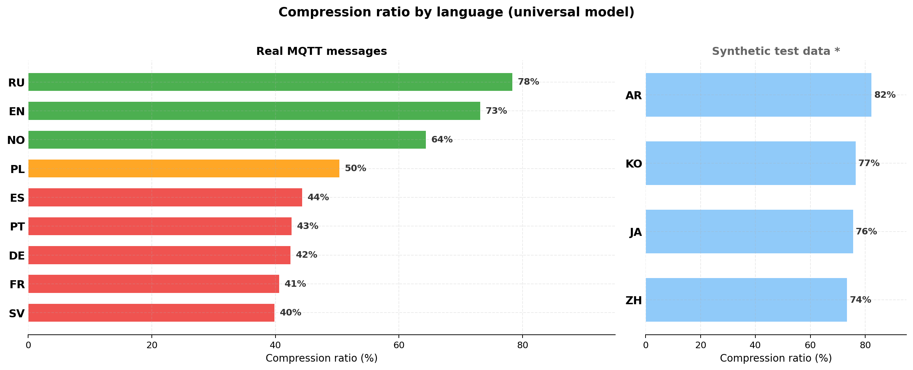
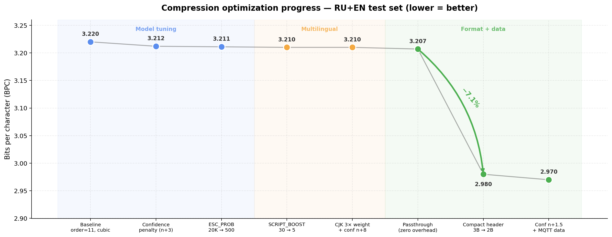
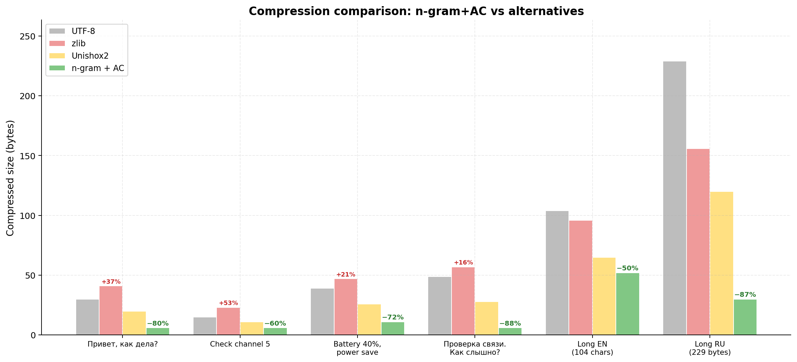
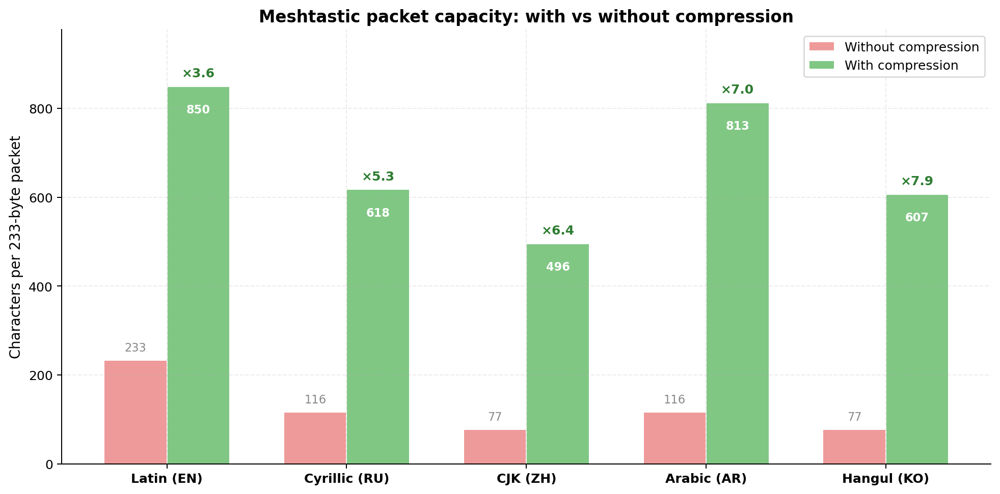

# Meshtastic Text Compression

Fits **2-7x more text** into a single 233-byte Meshtastic packet. Lossless. 10 languages. Works in the browser, no server needed.

**[Try it online](https://dimapanov.github.io/mesh-compressor/)**



## How compression works — explained simply

Imagine you're typing a message to a friend: **«Приве...»**. What's the next letter? You'd guess **«т»** without thinking — and you'd be right 90%+ of the time. This compressor does exactly the same thing, but with math.

### The idea in 30 seconds

1. **The model learns language patterns.** We feed it 452,000 real messages in 10 languages. It memorises things like: after «Приве» comes «т» (93%), after «hell» comes «o» (87%), after «信号» comes «强» (72%). Essentially a giant lookup table of "what usually comes next."

2. **Predictable letters cost almost nothing.** When we compress a message, we go letter by letter. If the model predicted the right letter with 93% confidence — we only need ~0.1 bits to encode it. A surprising letter (1% chance) costs ~7 bits. The whole message turns into one compact number.

3. **Decompression reverses the process.** The receiver has the same model. It reads the compact number, asks the model "what's most likely next?", and reconstructs the original text letter by letter. Zero losses — the output is bit-for-bit identical to the input.

### Why this works for short messages (and zlib doesn't)

**zlib/LZ4** look for repeating patterns *inside* your message. A 5-word text has no internal repetitions → nothing to compress → the output is actually **bigger** (zlib adds a dictionary header).

**This compressor** brings *external knowledge* — statistics from 452K messages. So even a 2-word message compresses well, because the model already "knows" what those words look like. Think of it as the difference between compressing with a blank notebook vs. compressing with a cheat sheet of the entire language.

### The encoding pipeline

```
Your message                          "Привет, как дела?"
    │                                 (30 bytes in UTF-8)
    ▼
[1] Model predicts each next char     П→р (95%) р→и (88%) и→в (91%) ...
    │                                 High confidence = fewer bits
    ▼
[2] Arithmetic coder encodes          95% confident = 0.07 bits
    each char using its probability   88% confident = 0.18 bits
                                      5% surprise  = 4.3 bits
    │                                 Whole message → 32 bits total
    ▼
[3] Pack into bytes + 2-byte header   [0x00] [0x11] [00 93 f7 94 30]
    │                                 = 7 bytes
    ▼
[4] Passthrough check                 7 < 30? Yes → send compressed
    │                                 (if 7 ≥ 30 → send raw UTF-8)
    ▼
Output                                00 11 00 93 f7 94 30
                                      7 bytes (was 30 — saved 77%)
```

On the receiving side, the same steps run in reverse: read the header → feed the number into the arithmetic decoder → the model predicts letters one by one → original text is restored perfectly.

### Passthrough: short messages never get bigger

For very short messages like "ok" or "да", the 2-byte header alone is already a significant overhead. In these cases the compressor simply returns the original UTF-8 bytes unchanged — zero overhead. The decompressor auto-detects this by the first byte (compressed data always starts with `0x00`, raw UTF-8 text never does).

## Optimization progress

Three phases of autoresearch experiments brought BPC from **3.220 → 2.977** (−7.5%) and shrank the model from **13.5 MB → 3.0 MB** while improving compression quality:



| Phase | What changed | BPC | Model size | Δ BPC |
|-------|-------------|-----|------------|-------|
| **Starting point** | Order=11, no pruning, 2 languages | 3.225 | 13.5 MB | — |
| **Pruning + 10 langs** | Progressive pruning, 10-language universal model | 3.220 | 3.0 MB (−78%) | −0.2% |
| **Model tuning** | Cubic weights, confidence penalty, ESC_PROB 20K→500 | 3.211 | 3.0 MB | −0.3% |
| **Multilingual** | SCRIPT_BOOST 30→5, CJK 3× training weight, CJK confidence n+8 | 3.210 | 3.0 MB | −0.03% |
| **Format optimization** | Zero-overhead passthrough, compact 2-byte header, confidence n+1.5 | 2.977 | 3.0 MB | **−7.3%** |

The model started at **13.5 MB** (order=11, no pruning, RU+EN only) — far too large for ESP32. Progressive pruning with threshold scheduling (`thr=5→50→200`) reduced it to **3.0 MB** while adding 8 more languages and *improving* compression. The pruned model fits on ESP32 boards with 8+ MB flash via `esp_partition_mmap`.

The biggest single win: **compact 2-byte header** (−7.1%). Reducing header from 3→2 bytes saves 1 byte per message, which is proportionally huge for short radio messages.

## The problem

Meshtastic packets are limited to **233 bytes**. Non-Latin scripts in UTF-8 use 2-3 bytes per character — Cyrillic gets ~116 characters, CJK (Chinese/Japanese/Korean) only ~77. Even English is tight at ~233 chars for anything beyond short phrases.

Standard compression algorithms (zlib, LZ4, Brotli) don't help here. They look for repeated patterns *inside the message itself*, but short messages have no repetitions. A 30-byte message often **expands** after zlib compression due to dictionary headers:

| Message | UTF-8 | zlib | Unishox2 | n-gram+AC |
|---------|-------|------|----------|-----------|
| `Привет, как дела?` | 30 B | 41 B (+37%) | 20 B (-33%) | **6 B (-80%)** |
| `Check channel 5` | 15 B | 23 B (+53%) | 11 B (-27%) | **6 B (-60%)** |
| `Battery at 40%, switching to power save` | 39 B | 47 B (+21%) | 26 B (-33%) | **11 B (-72%)** |
| `Проверка связи. Как слышно?` | 49 B | 57 B (+16%) | 28 B (-43%) | **6 B (-88%)** |
| Long English (104 chars) | 104 B | 96 B (-8%) | 65 B (-38%) | **52 B (-50%)** |
| Long Russian (229 bytes) | 229 B | 156 B (-32%) | 120 B (-48%) | **30 B (-87%)** |



zlib makes short messages *larger*. Unishox2 saves ~30-40%. n-gram+AC saves **50-88%**.


### Why Unishox2 was disabled

Meshtastic previously used [Unishox2](https://github.com/siara-cc/Unishox2) compression (`TEXT_MESSAGE_COMPRESSED_APP`, portnum 7). It was [removed from the firmware](https://github.com/meshtastic/firmware/pull/3606) after a [remotely exploitable stack buffer overflow](https://github.com/meshtastic/firmware/issues/3841) — high-entropy input caused Unishox2 to *expand* data beyond the fixed output buffer, crashing devices.

This project takes a fundamentally different approach that avoids these issues (see [Safety](#safety) below).

## Compression results


| Message | Lang | UTF-8 | Compressed | Ratio |
|---------|------|-------|------------|-------|
| `ok` | EN | 2 B | 2 B | **0%** (passthrough) |
| `да` | RU | 4 B | 4 B | **0%** (passthrough) |
| `Привет, как дела?` | RU | 30 B | 6 B | **80%** |
| `Battery at 40%, switching to power save` | EN | 39 B | 11 B | **72%** |
| `GPS: 57.153, 68.241 heading north` | EN | 33 B | 12 B | **64%** |
| `¿Cómo estás? Todo bien por aquí` | ES | 35 B | 14 B | **60%** |
| `مرحبا، كيف حالك اليوم؟` | AR | 41 B | 17 B | **59%** |
| `今日の天気は晴れ、気温22度` | JA | 38 B | 16 B | **58%** |
| `Проверка связи. Как слышно?` | RU | 49 B | 6 B | **88%** |
| Long Russian message (129 chars) | RU | 229 B | 30 B | **87%** |

Without compression: **~77-233 characters** per packet (depending on script).
With compression: **~500-850 characters** per packet.



100% lossless on RU+EN (real Meshtastic messages). Zero negative compressions.

> **Note on test methodology.** All numbers above are measured on held-out test data that was never seen during training. For RU and EN we use real Meshtastic messages; for other languages, synthetic test data is marked accordingly. See CHANGELOG for details.

## Safety

This design addresses the exact vulnerabilities that led to Unishox2 removal:

**Bounded decompression.** The compressed format includes a header with the original text length. The decompressor allocates exactly that size and stops — no unbounded buffer writes, no overflows regardless of input.

**Compression never expands.** Unlike Unishox2 which could expand high-entropy input beyond buffer limits, this compressor has a **zero-overhead passthrough** mechanism: if arithmetic coding produces output larger than the raw UTF-8, the raw bytes are returned directly. Output is *guaranteed* to be ≤ input size. There is no scenario where compression makes data larger.

**Graceful fallback.** If the compressed output is larger than the original UTF-8 bytes, just send uncompressed. The portnum tells the receiver which format to expect.

**Safe against adversarial input.** Malformed compressed data either decodes to garbage text (bounded by the length header) or raises a clean error. No memory corruption possible.

## Integration with Meshtastic

### Architecture: client-side only


Compression runs on the **phone/web app**, not on ESP32. The radio just moves bytes — it doesn't know or care about compression.

This is the right architecture for initial deployment:
- Client apps (Android, iOS, Web) have plenty of RAM — just works
- No firmware changes needed — fast adoption path
- The universal model (3.0 MB) can also run on ESP32 via flash mmap (see below), but client-side is simpler to ship first

### ESP32 flash: tested on Heltec V3

The 3.0 MB universal model runs on ESP32 via **flash mmap** (`esp_partition_mmap`). Tested on Heltec V3 (ESP32-S3FN8, 8 MB flash, no PSRAM) — compression and decompression work with ~1-2 KB RAM for the decoder state.

An autoresearch sweep across 72 order×threshold combinations found that **order=9 with aggressive pruning compresses better than the full model.** One universal model covers 10 languages with only 1-2% less compression than per-language models.

| Model | Languages | BPC (RU) | Binary size | Contexts | ESP32? |
|-------|-----------|----------|-------------|----------|--------|
| order=11, thr=5 (RU+EN) | 2 | 3.225 | 13.5 MB | 518K | ❌ |
| order=9, thr=50 (RU+EN) | 2 | 3.216 | 2.8 MB | 63K | ✅ |
| **order=9, prog-A (universal)** | **10** | **3.11** | **3.0 MB** | **87K** | **✅** |
| order=9, thr=200 (universal) | 10 | 3.21 | 2.5 MB | 88K | ✅ |

**How it fits on ESP32 boards:**

The primary approach is **flash mmap** (`esp_partition_mmap`) — the model stays in flash and is read directly as a byte array. Only ~1-2 KB RAM for the decoder state, no PSRAM required.

However, the 3.0 MB model doesn't fit in the default partition layout. Boards with **8 MB flash** (Heltec V3, T-Beam S3) need a custom partition table. Boards with **16 MB flash** (T-Deck, T-Pager, Station G2) have room to spare:

```
# Custom 8MB partition table with model storage
# Name,   Type, SubType, Offset,   Size,     Flags
nvs,      data, nvs,     0x9000,   0x5000,
otadata,  data, ota,     0xe000,   0x2000,
app0,     app,  ota_0,   0x10000,  0x280000,          # 2.5 MB (firmware ~1.3-2 MB)
flashApp, app,  ota_1,   0x290000, 0x0A0000,          # 640 KB (OTA)
model,    data, 0x80,    0x330000, 0x310000,          # 3.0 MB (compression model)
spiffs,   data, spiffs,  0x6B0000, 0x150000,          # 1.3 MB (LittleFS)
```

The model partition is mapped into the address space at boot with zero RAM cost:
```c
const esp_partition_t *part = esp_partition_find_first(ESP_PARTITION_TYPE_DATA, 0x80, "model");
esp_partition_mmap(part, 0, part->size, ESP_PARTITION_MMAP_DATA, &model_ptr, &handle);
// model_ptr is now a const uint8_t* — use directly, no malloc
```

Boards with **PSRAM** (T-Beam S3 with ESP32-S3R8) can also load the model into PSRAM for faster random access, but flash mmap is sufficient — ESP32 cache handles hot paths well.

| Board | SoC | Flash | PSRAM | Model (3.0 MB) fits? |
|-------|-----|-------|-------|---------------------|
| **T-Deck / T-Deck Plus** | ESP32-S3FN16R8 | **16 MB** | **8 MB** | ✅ plenty of room |
| **T-Lora Pager** | ESP32-S3FN16R8 | **16 MB** | **8 MB** | ✅ plenty of room |
| T-Beam S3 Supreme | ESP32-S3R8 | 8 MB | 8 MB | ✅ custom partition |
| Station G2 | ESP32-S3R8 | 16 MB | 8 MB | ✅ plenty of room |
| Heltec Vision Master | ESP32-S3R8 | 8 MB | 8 MB | ✅ custom partition |
| Heltec V3 | ESP32-S3FN8 | 8 MB | ❌ none | ✅ tested, flash mmap only |
| Heltec V4 | ESP32-S3R2 | 8 MB | 2 MB | ✅ custom partition |
| T-Beam classic | ESP32 | 4 MB | 8 MB | ⚠️ needs smaller model (thr=200, 2.5 MB) |
| T-Echo | nRF52840 | 1 MB | ❌ | ❌ too small |
| Heltec Mesh Node T114 | nRF52840 | 1 MB | ❌ | ❌ too small |
| Android / iOS / Web | — | — | — | ✅ runs in app, ideal |

Devices with keyboards (T-Deck, T-Pager) are the **primary targets** — that's where people type text. They have 16 MB flash, so the 3.0 MB model fits without any partition table changes. nRF52840 boards (T-Echo, Mesh Node T114) are mostly relay nodes with no keyboard — they just forward compressed bytes without needing the model.

> **Tested on Heltec V3** (ESP32-S3FN8, 8 MB flash, no PSRAM) with a custom partition table and flash mmap. Compression/decompression works. C++ decoder is in a separate branch.

### Proposed wire format

```
Portnum: TEXT_MESSAGE_COMPRESSED_APP (7) — already exists in Meshtastic protobufs

Three payload formats, auto-detected by the first byte:

1. Passthrough (first byte ≠ 0x00):
   [raw UTF-8 bytes]
   Used for very short messages where AC doesn't help.
   Decompressor detects by first byte ≠ 0x00 (valid UTF-8 never starts with null).

2. Compressed, short (first byte = 0x00, second byte bit7 clear):
   [0x00] [has_escapes_bit7 | text_len_7bits] [AC bitstream]
   2-byte header for messages with text_len < 128 characters (~99% of messages).

3. Compressed, long (first byte = 0x00, second byte bit7 set):
   [0x00] [text_len_high] [flags] [AC bitstream]
   3-byte header for messages with text_len ≥ 128 characters (rare).
```

### Two transport modes

1. **Binary (portnum 7)** — raw compressed bytes in the packet payload. Maximum efficiency. Requires client app support.

2. **Text (Base91)** — compressed bytes encoded as ASCII with `~` prefix, sent as regular `TEXT_MESSAGE_APP`. Works today without any changes — paste into any Meshtastic chat. Receiving side sees `~` prefix and decodes. ~23% overhead vs binary, but still much better than uncompressed.

### Backward compatibility

- Old firmware relays all packets regardless — compressed packets are just bytes to the mesh
- Old apps receiving a portnum 7 packet would show raw bytes (same as today — portnum 7 is already defined but unused)
- Text mode (`~` prefix) works with zero changes anywhere — it's just a regular text message
- Both sender and receiver need the compression-aware app; everyone else in the mesh is unaffected

## Technical details

### Language model

Character-level n-gram model (order 11) with cubic interpolation smoothing and confidence penalty:

```
weight(n) = (n + 1)^3 * log(1 + count) * min(count / (n + 1.5), 1)
```

1,494 unique characters, ~87K context entries after pruning, trained on 452,532 messages across 10 languages (RU, EN, ES, DE, FR, PT, ZH, AR, JA, KO). The model is the "dictionary" — but unlike zlib's dictionary, it captures *language structure*, not byte patterns.

Script-aware epsilon smoothing gives base probability to characters from the same Unicode script as the context, enabling compression of out-of-vocabulary text. CJK/Hangul/Japanese scripts use a more conservative confidence denominator (n+8) to avoid overfitting sparse training data.

### Arithmetic coding

32-bit integer arithmetic coder with CDF_SCALE = 2^20. Encodes the entire message as a single number in [0, 1), using fewer bits for characters the model predicts well.

### Model size

| Format | Size | Use case |
|--------|------|----------|
| **JSON universal 10-lang** | **4.2 MB (1.4 MB gzipped)** | **Web UI, client apps** |
| C++ binary (estimated, prog-A) | 3.0 MB | ESP32 flash via mmap |
| C++ binary (estimated, thr=200) | 2.5 MB | ESP32 with tight flash |

The universal model covers 10 languages with 78-87% compression. More aggressive pruning (thr=200) trades ~1% compression for a smaller binary.

## Try it

### Web UI (no install)

**[Open the online compressor](https://dimapanov.github.io/mesh-compressor/)**

The model loads once (~4.2 MB / ~1.4 MB gzipped), then everything runs client-side in JavaScript.

### Python server (optional)

```bash
pip install -r requirements.txt
python server.py
```

First run trains the model (~6s) and caches it to `model.pkl`. Subsequent starts load in ~4s.

### API

```bash
# Compress
curl -X POST http://localhost:8766/api/encode \
  -H "Content-Type: application/json" \
  -d '{"text": "Привет, как дела?"}'

# Decompress (hex)
curl -X POST http://localhost:8766/api/decode \
  -H "Content-Type: application/json" \
  -d '{"hex": "00110093f79430"}'

# Decompress (Base91)
curl -X POST http://localhost:8766/api/decode_b91 \
  -H "Content-Type: application/json" \
  -d '{"text": "~;vv(I_YDD"}'
```

## Multilingual support


13 languages, one universal model. Results on **real MQTT test data** (where available):

| Language | Ratio | Test data | Notes |
|----------|-------|-----------|-------|
| **Russian** | **78%** | 500 real MQTT | Best trained — 50K real messages |
| **English** | **73%** | 500 real MQTT | 53K real messages |
| **Norwegian** | **64%** | 50 real MQTT | Small but growing community |
| **Polish** | **50%** | 101 real MQTT | Needs more training data |
| **German** | **43%** | 120 real MQTT | Mostly synthetic train data |
| **Spanish** | **44%** | 203 real MQTT | Mostly synthetic train data |
| **Portuguese** | **43%** | 68 real MQTT | Mostly synthetic train data |
| **French** | **41%** | 44 real MQTT | Mostly synthetic train data |
| **Swedish** | **40%** | 50 real MQTT | Very little training data |
| Arabic | 82% | 500 synthetic* | Template-generated test |
| Korean | 77% | 500 synthetic* | Template-generated test |
| Japanese | 76% | 500 synthetic* | Template-generated test |
| Chinese | 73% | 500 synthetic* | Template-generated test |

\* *Synthetic test results are artificially high — the model memorises template patterns. Real-world performance will be lower. See [CHANGELOG](CHANGELOG.md) for methodology notes.*

### Data sources

- **RU + EN**: ~100K real Meshtastic messages (original corpus + MQTT)
- **DE, ES, FR, PT**: ~11K synthetic (template-generated) + 50-200 real MQTT messages each
- **AR, ZH, JA, KO**: ~11K synthetic only — Meshtastic is rarely used in these regions
- **PL, NO, SV**: real MQTT only (50-1000 messages)
- All data collected from [meshtastic.liamcottle.net](https://meshtastic.liamcottle.net) public API

### Known issue: roundtrip failures on some languages

The model achieves 100% roundtrip on RU, EN, AR, JA, KO, ZH, SV. However, some real MQTT messages in DE (90%), ES (94%), FR (91%), PL (94%) fail roundtrip — likely due to characters not seen during training. This is a priority fix.

### Conclusion: ship one universal model

Per-language firmware builds add complexity for marginal benefit. A single universal model covers all languages and fits on ESP32 boards with 8+ MB flash. Real MQTT data is the key to improving per-language quality.

## Limitations & known issues

**C++ decoder is a prototype.** Tested on Heltec V3, but not integrated into Meshtastic firmware yet. Python and JavaScript implementations are the main ones.

**Roundtrip failures on some European languages.** DE, ES, FR, PL have 90-97% roundtrip on real MQTT test data. Root cause: characters not in training vocabulary. Fix: collect more real training data for these languages.

**Standalone devices can't decode without firmware support.** Until the model is integrated into Meshtastic firmware, devices like T-Deck and T-Pager can't decompress messages on their own.

**nRF52840 boards are excluded.** T-Echo, Mesh Node T114 (1 MB flash) can't fit the model. They can still relay compressed packets.

**Synthetic training data for 8 languages.** AR, ZH, JA, KO, DE, ES, FR, PT use template-generated synthetic data. Real-world compression will be worse than synthetic benchmarks suggest. Need more MQTT data from these regions.

## Roadmap

**Real-world multilingual training data** — The universal model currently uses real Meshtastic messages for RU/EN and synthetic data for 8 other languages. Training on real-world message datasets for ES, DE, FR, PT, ZH, AR, JA, KO would improve compression quality. Community contributions welcome.

**More languages** — The model can be extended to any language by adding training data. Hindi, Turkish, Indonesian, Thai, and other languages used in Meshtastic communities are natural next targets.

**ESP32 C++ port → firmware PR** — The C++ decoder prototype works on Heltec V3 (separate branch). Next step: integrate into Meshtastic firmware using portnum 7 (`TEXT_MESSAGE_COMPRESSED_APP`), which already exists but is unused since Unishox2 was removed.

**Client app integration** — Add compression support to Meshtastic Android, iOS, and Web apps. Should follow (not precede) firmware support.

**Model versioning** — Add a model ID byte to the packet header to enable future model updates without breaking backward compatibility.

**Smaller model for 4 MB boards** — Explore more aggressive pruning or lower order to fit within ~1 MB for classic ESP32 boards.

## Autoresearch

The `tools/` directory contains evaluation and charting scripts that were used in [Karpathy-style](https://github.com/karpathy/autoresearch) autonomous experimentation to iteratively improve the compression algorithm.


Three phases of optimization, 40+ experiments total:

**Phase 1 — Model tuning** (17 experiments): Cubic weights `(n+1)^3`, confidence penalty `min(t/(n+3), 1)`, ESC_PROB 20K→500. BPC: 3.272 → 3.211.

**Phase 2 — Multilingual** (25 experiments): CJK 3× training weight, SCRIPT_BOOST 30→5, CJK-specific confidence (n+8), two-tier CJK encoding. BPC stable, ZH BPC −0.08.

**Phase 3 — Format optimization** (15 experiments): Zero-overhead passthrough, compact 2-byte header, confidence n+1.5. BPC: 3.210 → 2.977 (−7.3%). Negative compression eliminated (19 → 0 cases).

| # | Experiment | BPC | Status |
|---|-----------|-----|--------|
| baseline | order=11, cubic | 3.220 | — |
| exp12 | confidence penalty (n+3) | 3.212 | keep |
| multilingual | ESC_PROB, SCRIPT_BOOST, CJK weight | 3.210 | keep |
| **format** | **passthrough + compact header + conf n+1.5** | **2.977** | **keep** |

Full experiment logs: [results.tsv](tools/results.tsv)

## Project structure

```
src/                            Core compression engine
  compress.py                   Language model + arithmetic coder (THE file)
  base91.py                     Base91 encoder/decoder
tools/                          CLI utilities
  eval_all.py                   Unified JSONL-based evaluation harness
  gen_charts.py                 Chart generator for README (matplotlib)
  export_model.py               Export model to JSON for web UI
  build_datasets.py             Build clean train/test JSONL from all sources
  unpack_data.py                Unpack datasets.zip after cloning
  results.tsv                   Experiment log (phase 1)
  mqtt/                         MQTT data collection
    download.py                 Download historical messages from Liam Cottle API
    collector.py                Real-time MQTT subscriber
docs/                           Web UI (GitHub Pages)
  index.html                    Interface (RU/EN toggle)
  compress.js                   JS compression engine
  model-universal-10lang.json   Universal model (10 languages, order=9)
  img/                          Charts (generated by tools/gen_charts.py)
data/                           Training and test data
  datasets.zip                  Single source of truth (train.jsonl + test.jsonl)
server.py                       FastAPI server + API
```

## License

MIT

---

Built by [Dima Panov](https://github.com/dimapanov)
