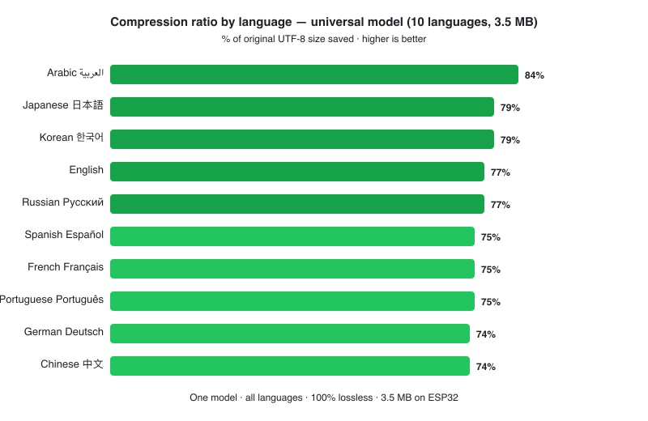
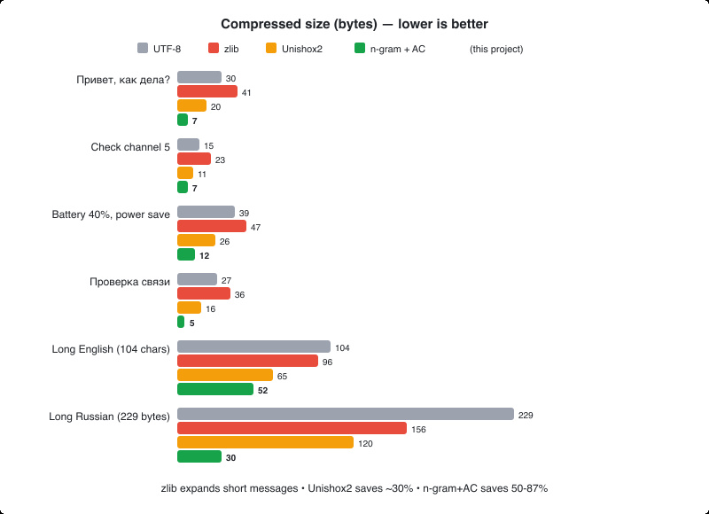
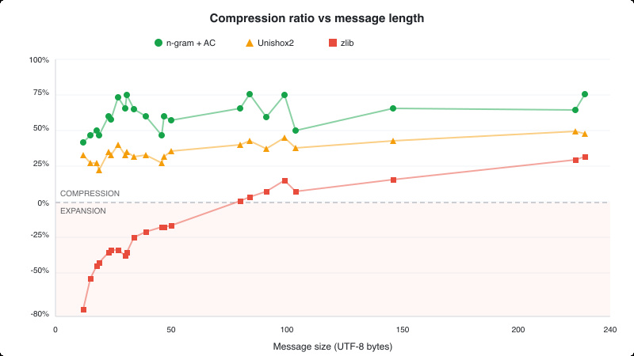
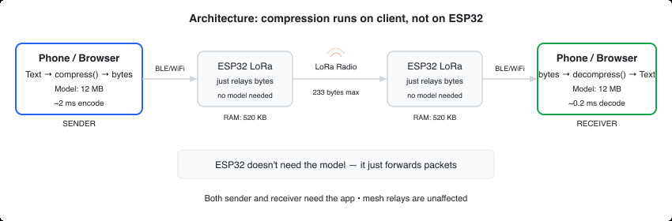

# Meshtastic Text Compression

Fits **2-7x more text** into a single 233-byte Meshtastic packet. Lossless. 10 languages. Works in the browser, no server needed.

**[Try it online](https://dimapanov.github.io/mesh-compressor/)**



## The problem

Meshtastic packets are limited to **233 bytes**. Non-Latin scripts in UTF-8 use 2-3 bytes per character — Cyrillic gets ~116 characters, CJK (Chinese/Japanese/Korean) only ~77. Even English is tight at ~233 chars for anything beyond short phrases.

Standard compression algorithms (zlib, LZ4, Brotli) don't help here. They look for repeated patterns *inside the message itself*, but short messages have no repetitions. A 30-byte message often **expands** after zlib compression due to dictionary headers:

| Message | UTF-8 | zlib | Unishox2 | n-gram+AC |
|---------|-------|------|----------|-----------|
| `Привет, как дела?` | 30 B | 41 B (+37%) | 20 B (-33%) | **7 B (-77%)** |
| `Check channel 5` | 15 B | 23 B (+53%) | 11 B (-27%) | **7 B (-53%)** |
| `Battery at 40%, switching to power save` | 39 B | 47 B (+21%) | 26 B (-33%) | **12 B (-69%)** |
| `Проверка связи. Как слышно?` | 49 B | 57 B (+16%) | 28 B (-43%) | **7 B (-86%)** |
| Long English (104 chars) | 104 B | 96 B (-8%) | 65 B (-38%) | **52 B (-50%)** |
| Long Russian (229 bytes) | 229 B | 156 B (-32%) | 120 B (-48%) | **30 B (-87%)** |



zlib makes short messages *larger*. Unishox2 saves ~30-40%. n-gram+AC saves **50-87%**.

### Why Unishox2 was disabled

Meshtastic previously used [Unishox2](https://github.com/siara-cc/Unishox2) compression (`TEXT_MESSAGE_COMPRESSED_APP`, portnum 7). It was [removed from the firmware](https://github.com/meshtastic/firmware/pull/3606) after a [remotely exploitable stack buffer overflow](https://github.com/meshtastic/firmware/issues/3841) — high-entropy input caused Unishox2 to *expand* data beyond the fixed output buffer, crashing devices.

This project takes a fundamentally different approach that avoids these issues (see [Safety](#safety) below).

## How it works

Think of it as **T9 on steroids**. T9 looks at 1-2 previous characters and suggests a word. This model looks at up to 9 previous characters and predicts the probability of every possible next character: "after `Приве` the next character is `т` with 93% probability."

The arithmetic coder then uses these predictions: predictable characters cost nearly **0 bits**, surprising ones cost more. The entire message becomes a single compact number.

The key difference from zlib/LZ4/Unishox2: those algorithms look for patterns *inside your message*. This model brings **external knowledge** — statistics from 452,000 training messages in 10 languages — so it compresses well even on 2-word texts.

### Compression results



| Message | Lang | UTF-8 | Compressed | Ratio |
|---------|------|-------|------------|-------|
| `Привет, как дела?` | RU | 30 B | 7 B | **77%** |
| `Battery at 40%, switching to power save` | EN | 39 B | 12 B | **69%** |
| `GPS: 57.153, 68.241 heading north` | EN | 33 B | 12 B | **64%** |
| `¿Cómo estás? Todo bien por aquí` | ES | 35 B | 14 B | **60%** |
| `مرحبا، كيف حالك اليوم؟` | AR | 41 B | 17 B | **59%** |
| `今日の天気は晴れ、気温22度` | JA | 38 B | 16 B | **58%** |
| `Проверка связи. Как слышно?` | RU | 49 B | 7 B | **86%** |
| Long Russian message (129 chars) | RU | 229 B | 30 B | **87%** |
| Long English message (104 chars) | EN | 104 B | 52 B | **50%** |

Without compression: **~77-233 characters** per packet (depending on script).
With compression: **~300-900 characters** per packet.

100% lossless. Roundtrip-verified on every test message.

## Safety

This design addresses the exact vulnerabilities that led to Unishox2 removal:

**Bounded decompression.** The compressed format includes a 2-byte header with the original text length. The decompressor allocates exactly that size and stops — no unbounded buffer writes, no overflows regardless of input.

**Compression never expands dangerously.** Unlike Unishox2 which could expand high-entropy input beyond buffer limits, arithmetic coding has a theoretical maximum expansion of ~1 bit per character (the EOF marker overhead). For a 233-byte input, worst case is ~234 bytes — never a crash-inducing expansion.

**Graceful fallback.** If the compressed output is larger than the original UTF-8 bytes, just send uncompressed. The portnum tells the receiver which format to expect.

**Safe against adversarial input.** Malformed compressed data either decodes to garbage text (bounded by the length header) or raises a clean error. No memory corruption possible.

## Integration with Meshtastic

### Architecture: client-side only



Compression runs on the **phone/web app**, not on ESP32. The radio just moves bytes — it doesn't know or care about compression.

This is the right architecture for initial deployment:
- Client apps (Android, iOS, Web) have plenty of RAM — just works
- No firmware changes needed — fast adoption path
- The universal model (3.0 MB) can also run on ESP32 via flash mmap (see below), but client-side is simpler to ship first

### ESP32 flash: it might actually work

An [autoresearch sweep](autoresearch/search_results.tsv) across 72 order×threshold combinations found a surprising result: **order=9 with aggressive pruning compresses better than the full model.** A [multilingual experiment](autoresearch/multilingual_results.tsv) confirmed that one universal model covers 10 languages with only 1-2% less compression than per-language models.

| Model | Languages | BPC (RU) | Binary size | Contexts | ESP32? |
|-------|-----------|----------|-------------|----------|--------|
| order=11, thr=5 (RU+EN) | 2 | 3.225 | 13.5 MB | 518K | ❌ |
| order=9, thr=50 (RU+EN) | 2 | 3.216 | 2.8 MB | 63K | ✅ |
| **order=9, prog-A (universal)** | **10** | **3.11** | **3.0 MB** | **87K** | **✅** |
| order=9, thr=200 (universal) | 10 | 3.21 | 2.5 MB | 88K | ✅ |

**How it fits on ESP32 boards:**

The primary approach is **flash mmap** (`esp_partition_mmap`) — the model stays in flash and is read directly as a byte array. Only ~1-2 KB RAM for the decoder state, no PSRAM required.

However, the 3.0 MB model doesn't fit in the default partition layout. Boards with **8 MB flash** (Heltec V3, T-Beam S3) need a custom partition table. Boards with **16 MB flash** (T-Deck, T-Pager, Station G2) have room to spare:

```
# Custom 8MB partition table with model storage
# Name,   Type, SubType, Offset,   Size,     Flags
nvs,      data, nvs,     0x9000,   0x5000,
otadata,  data, ota,     0xe000,   0x2000,
app0,     app,  ota_0,   0x10000,  0x280000,          # 2.5 MB (firmware ~1.3-2 MB)
flashApp, app,  ota_1,   0x290000, 0x0A0000,          # 640 KB (OTA)
model,    data, 0x80,    0x330000, 0x310000,          # 3.0 MB (compression model)
spiffs,   data, spiffs,  0x6B0000, 0x150000,          # 1.3 MB (LittleFS)
```

The model partition is mapped into the address space at boot with zero RAM cost:
```c
const esp_partition_t *part = esp_partition_find_first(ESP_PARTITION_TYPE_DATA, 0x80, "model");
esp_partition_mmap(part, 0, part->size, ESP_PARTITION_MMAP_DATA, &model_ptr, &handle);
// model_ptr is now a const uint8_t* — use directly, no malloc
```

Boards with **PSRAM** (T-Beam S3 with ESP32-S3R8) can also load the model into PSRAM for faster random access, but flash mmap is sufficient — ESP32 cache handles hot paths well.

> **Note:** Heltec V3 uses ESP32-S3**FN**8 — **no PSRAM** (the "N" = No PSRAM). Flash mmap is the only option for this board.

| Board | SoC | Flash | PSRAM | Model (3.0 MB) fits? |
|-------|-----|-------|-------|---------------------|
| **T-Deck / T-Deck Plus** | ESP32-S3FN16R8 | **16 MB** | **8 MB** | ✅ plenty of room |
| **T-Lora Pager** | ESP32-S3FN16R8 | **16 MB** | **8 MB** | ✅ plenty of room |
| T-Beam S3 Supreme | ESP32-S3R8 | 8 MB | 8 MB | ✅ custom partition |
| Station G2 | ESP32-S3R8 | 16 MB | 8 MB | ✅ plenty of room |
| Heltec Vision Master | ESP32-S3R8 | 8 MB | 8 MB | ✅ custom partition |
| Heltec V3 | ESP32-S3FN8 | 8 MB | ❌ none | ✅ custom partition, flash mmap only |
| Heltec V4 | ESP32-S3R2 | 8 MB | 2 MB | ✅ custom partition |
| T-Beam classic | ESP32 | 4 MB | 8 MB | ⚠️ needs smaller model (thr=200, 2.5 MB) |
| T-Echo | nRF52840 | 1 MB | ❌ | ❌ too small |
| Heltec Mesh Node T114 | nRF52840 | 1 MB | ❌ | ❌ too small |
| Android / iOS / Web | — | — | — | ✅ runs in app, ideal |

Devices with keyboards (T-Deck, T-Pager) are the **primary targets** — that's where people type text. They have 16 MB flash, so the 3.0 MB model fits without any partition table changes. nRF52840 boards (T-Echo, Mesh Node T114) are mostly relay nodes with no keyboard — they just forward compressed bytes without needing the model.

Not tested on real hardware yet — this is a proof of concept.

### Proposed wire format

```
Portnum: TEXT_MESSAGE_COMPRESSED_APP (7) — already exists in Meshtastic protobufs

Payload:
[2 bytes: original text length, uint16 BE]
[1 byte: number of extra characters not in model vocabulary]
[extra chars as UTF-8, each prefixed by 1-byte length]
[arithmetic-coded bitstream]
```

### Two transport modes

1. **Binary (portnum 7)** — raw compressed bytes in the packet payload. Maximum efficiency. Requires client app support.

2. **Text (Base91)** — compressed bytes encoded as ASCII with `~` prefix, sent as regular `TEXT_MESSAGE_APP`. Works today without any changes — paste into any Meshtastic chat. Receiving side sees `~` prefix and decodes. ~23% overhead vs binary, but still much better than uncompressed.

### Backward compatibility

- Old firmware relays all packets regardless — compressed packets are just bytes to the mesh
- Old apps receiving a portnum 7 packet would show raw bytes (same as today — portnum 7 is already defined but unused)
- Text mode (`~` prefix) works with zero changes anywhere — it's just a regular text message
- Both sender and receiver need the compression-aware app; everyone else in the mesh is unaffected

## Technical details

### Language model

Character-level n-gram model (order 9) with cubic interpolation smoothing:

```
weight(n) = (n + 1)^3 * log(1 + count)
```

1,494 unique characters, ~87K context entries after pruning, trained on 452,532 messages across 10 languages (RU, EN, ES, DE, FR, PT, ZH, AR, JA, KO). The model is the "dictionary" — but unlike zlib's dictionary, it captures *language structure*, not byte patterns.

### Arithmetic coding

32-bit integer arithmetic coder with CDF_SCALE = 2^20. Encodes the entire message as a single number in [0, 1), using fewer bits for characters the model predicts well.

### Model size

| Format | Size | Use case |
|--------|------|----------|
| **JSON universal 10-lang** | **4.2 MB (1.4 MB gzipped)** | **Web UI, client apps** |
| C++ binary (estimated, prog-A) | 3.0 MB | ESP32 flash via mmap |
| C++ binary (estimated, thr=200) | 2.5 MB | ESP32 with tight flash |

The universal model covers 10 languages with 72-84% compression. More aggressive pruning (thr=200) trades ~1% compression for a smaller binary.

## Try it

### Web UI (no install)

**[Open the online compressor](https://dimapanov.github.io/mesh-compressor/)**

The model loads once (~4.2 MB / ~1.4 MB gzipped), then everything runs client-side in JavaScript.

### Python server (optional)

```bash
pip install -r requirements.txt
python server.py
```

First run trains the model (~6s) and caches it to `model.pkl`. Subsequent starts load in ~4s.

### API

```bash
# Compress
curl -X POST http://localhost:8766/api/encode \
  -H "Content-Type: application/json" \
  -d '{"text": "Привет, как дела?"}'

# Decompress (hex)
curl -X POST http://localhost:8766/api/decode \
  -H "Content-Type: application/json" \
  -d '{"hex": "00110093f79430"}'

# Decompress (Base91)
curl -X POST http://localhost:8766/api/decode_b91 \
  -H "Content-Type: application/json" \
  -d '{"text": "~;vv(I_YDD"}'
```

## Multilingual support


### Experiment results

We tested two strategies: **one universal model** (all languages) vs **per-language models** (one per language). Trained on 45,000 messages per language with order=9.

| Language | Per-language | Universal | Difference |
|----------|-------------|-----------|------------|
| Arabic | 85% | **84%** | -1% |
| Japanese | 82% | **79%** | -3% |
| Korean | 81% | **79%** | -2% |
| Spanish | 79% | **77%** | -2% |
| Russian | 78% | **77%** | -1% |
| English | 75% | **73%** | -2% |
| French | 77% | **75%** | -2% |
| Portuguese | 77% | **75%** | -2% |
| German | 76% | **74%** | -2% |
| Chinese | 77% | **74%** | -3% |

Per-language models win by 1-3%, but the universal model covers all 10 languages in a single 3.0 MB binary (4.2 MB JSON). 100% lossless roundtrip on all languages.

### Conclusion: ship one universal model

Per-language firmware builds add complexity (model versioning, cross-language fallback, build matrix) for only 1-3% better compression. A single universal model is simpler, works for everyone, and fits on ESP32 boards with 8+ MB flash.

Full experiment data: [multilingual_results.tsv](autoresearch/multilingual_results.tsv)

## Limitations & known issues

**No firmware implementation yet.** Everything runs in Python/JavaScript. The ESP32 feasibility analysis is theoretical — no C++ port, no real hardware testing.

**Standalone devices can't decode without firmware support.** Until the model is integrated into Meshtastic firmware, devices like T-Deck and T-Pager can't decompress messages on their own. This could fragment the network if compression is used via client apps only. Firmware-first integration is critical to avoid this.

**nRF52840 boards are excluded.** T-Echo, Mesh Node T114, and other nRF52840-based devices have only 1 MB flash — the model doesn't fit. These devices can still *relay* compressed packets (they're just bytes), but can't encode or decode. Since most nRF52840 devices lack keyboards and screens, this is acceptable for relay-only use.

**4 MB flash boards are tight.** Classic T-Beam and similar boards with 4 MB flash would need a significantly smaller model (~1 MB), trading compression quality for compatibility.

**Training data quality.** RU and EN are trained on 46K real Meshtastic messages each. Other 8 languages use 45K synthetic (template-generated) messages each — real-world performance may differ. Community contributions of real message datasets in any language are welcome.

## Roadmap

**Real-world multilingual training data** — The universal model currently uses real Meshtastic messages for RU/EN and synthetic data for 8 other languages. Training on real-world message datasets for ES, DE, FR, PT, ZH, AR, JA, KO would improve compression quality. Community contributions welcome.

**More languages** — The model can be extended to any language by adding training data. Hindi, Turkish, Indonesian, Thai, and other languages used in Meshtastic communities are natural next targets.

**ESP32 C++ port** — Implement the decoder (and encoder) in C++ using `esp_partition_mmap` to read the model from flash. Target boards: T-Deck, T-Pager (16 MB flash), Heltec V3 (8 MB, custom partition). This is the critical path — firmware support must come before client app adoption to avoid network fragmentation.

**Meshtastic firmware PR** — Integrate compression into the Meshtastic firmware using portnum 7 (`TEXT_MESSAGE_COMPRESSED_APP`), which already exists but is unused since Unishox2 was removed.

**Client app integration** — Add compression support to Meshtastic Android, iOS, and Web apps. Should follow (not precede) firmware support.

**Model versioning** — Add a model ID byte to the packet header to enable future model updates without breaking backward compatibility.

**Smaller model for 4 MB boards** — Explore more aggressive pruning or lower order to fit within ~1 MB for classic ESP32 boards.

## Autoresearch

The `autoresearch/` directory contains a [Karpathy-style](https://github.com/karpathy/autoresearch) autonomous experimentation framework that iteratively improves the compression algorithm.

Weighting experiments found **cubic weights (n+1)^3** as the best interpolation scheme. A [model size sweep](autoresearch/search_results.tsv) across 72 order×threshold combinations found that aggressive pruning improves compression. A [multilingual experiment](autoresearch/multilingual_results.tsv) confirmed that one universal model covers 10 languages with only 1-3% less compression than per-language models.

| # | Experiment | BPC | Status |
|---|-----------|-----|--------|
| baseline | order=7, quadratic | 3.272 | -- |
| bi02 | order=11 | 3.226 | better |
| **bi05** | **cubic (n+1)^3** | **3.220** | **best** |
| bi06 | quartic (n+1)^4 | 3.286 | worse |

## Project structure

```
docs/                           Web UI (GitHub Pages)
  index.html                    Interface (RU/EN toggle)
  compress.js                   JS compression engine
  model-universal-10lang.json   Universal model (10 languages, order=9)
data/                           Training and test data
  train.txt                     92K training messages (RU + EN)
  test.txt                      2K test messages (RU)
  multilingual/                 Multilingual datasets (45K/lang)
    train_{lang}.txt            Training data (es, de, fr, pt, zh, ar, ja, ko)
    test_{lang}.txt             Test data per language
server.py                       FastAPI server + API
base91.py                       Base91 encoder/decoder
export_model.py                 Export model to JSON
autoresearch/                   Experimentation framework
  compress.py                   Language model + arithmetic coder
  search_small_model.py         Model size/quality sweep
  search_results.tsv            Full sweep results (72 combinations)
  experiment_multilingual.py    Universal vs per-language comparison
  generate_multilingual.py      Synthetic multilingual data generator
  multilingual_results.tsv      Multilingual experiment results
```

## License

MIT

---

Built by [Dima Panov](https://github.com/dimapanov)
